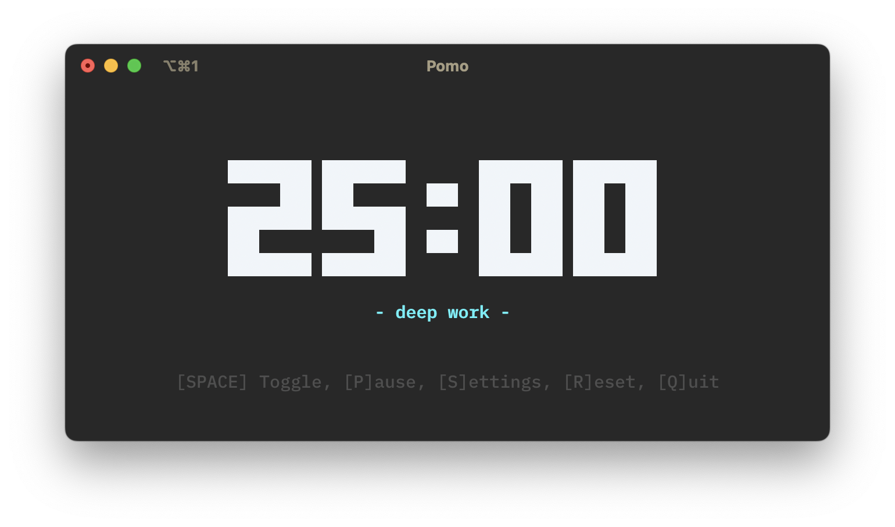
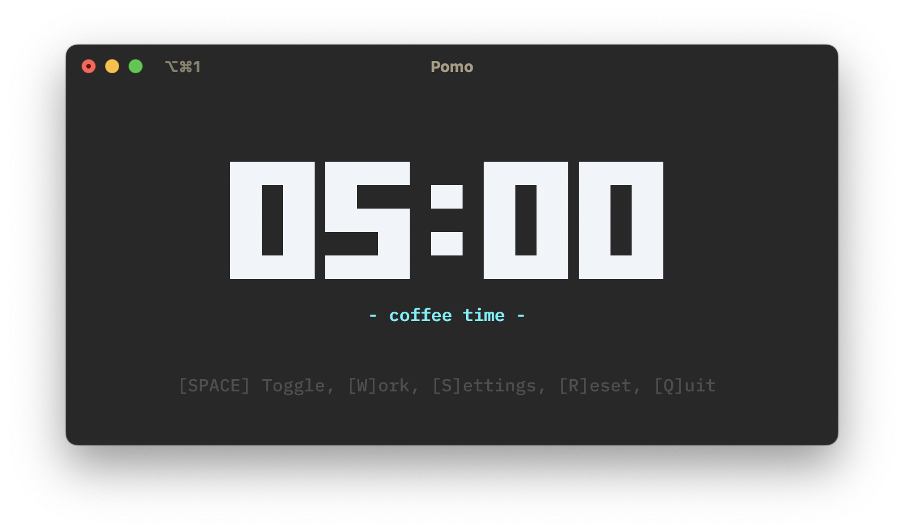
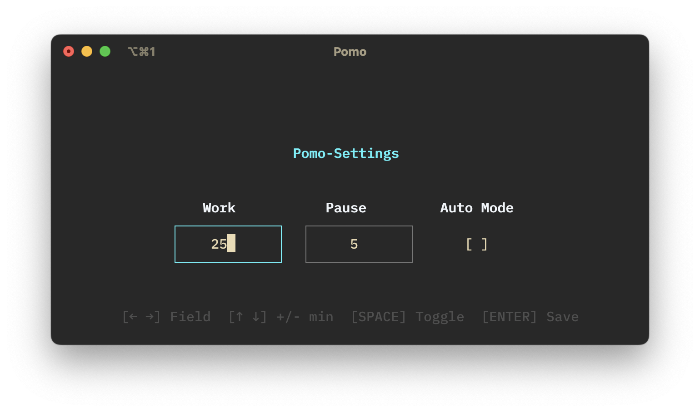

# Pomo

A beautiful terminal-based Pomodoro Timer written in Go with a sleek TUI interface.

## Screenshots


_Work mode - Stay focused_


_Pause mode - Time to recharge_


_Settings - Customize your timers_

## What is the Pomodoro Technique?

The Pomodoro Technique is a time management method that uses a timer to break work into intervals, traditionally 25 minutes in length, separated by short pauses. These intervals are known as "pomodoros", named after the tomato-shaped kitchen timer that Francesco Cirillo used as a university student.

The technique helps improve focus and productivity by creating structured work sessions with regular pauses. After completing four pomodoros, you take a longer pause of 15-30 minutes.

Learn more about the [Pomodoro Technique on Wikipedia](https://en.wikipedia.org/wiki/Pomodoro_Technique).

## Installation

### Requirements

- Go 1.19 or higher
- Terminal with Unicode support
- Audio support for notification sounds

### Install

```bash
# Clone the repository
git clone https://github.com/jpierer/pomo.git

# Navigate to the project directory
cd pomo

# Build the application
go build

# Run the app
./pomo
```

Or install directly with Go:

```bash
go install github.com/jpierer/pomo@latest
```

## Features

- **Beautiful TUI Interface** - Clean, modern terminal interface using Bubble Tea
- **Customizable Timers** - Set custom work and pause durations (1-60 minutes)
- **Auto-Iterate Mode** - Automatically switch between work and pause sessions
- **Sound Notifications** - Audio alerts when sessions complete
- **Elegant Design** - Stylish ASCII art timer display
- **Lightweight** - Fast and minimal resource usage
- **Cross-Platform** - Works on macOS, Linux, and Windows
- **Keyboard Shortcuts** - Full keyboard navigation and controls

### Controls

- `SPACE` - Start/Stop current timer
- `S` - Open settings
- `R` - Reset current timer
- `W` - Switch to work mode
- `P` - Switch to pause mode
- `Q` - Quit application
- `↑/↓` - Adjust values in settings
- `←/→` - Navigate between settings fields

## Support Me

Give a ⭐ if this project was helpful in any way!

## License

The code is released under the [MIT LICENSE](LICENSE).
